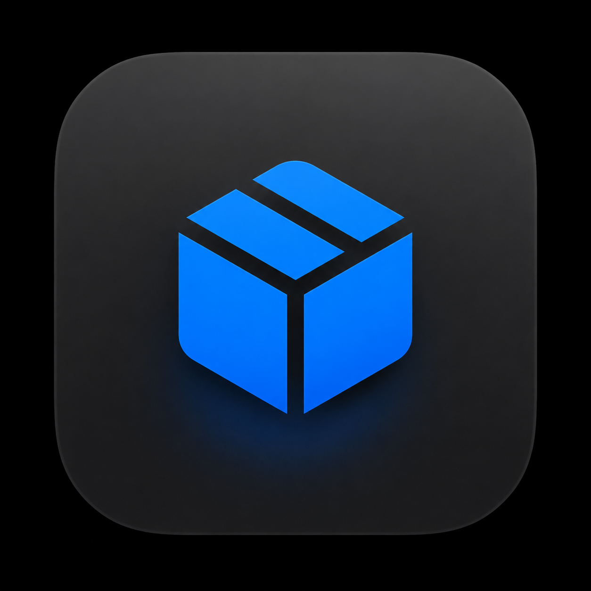
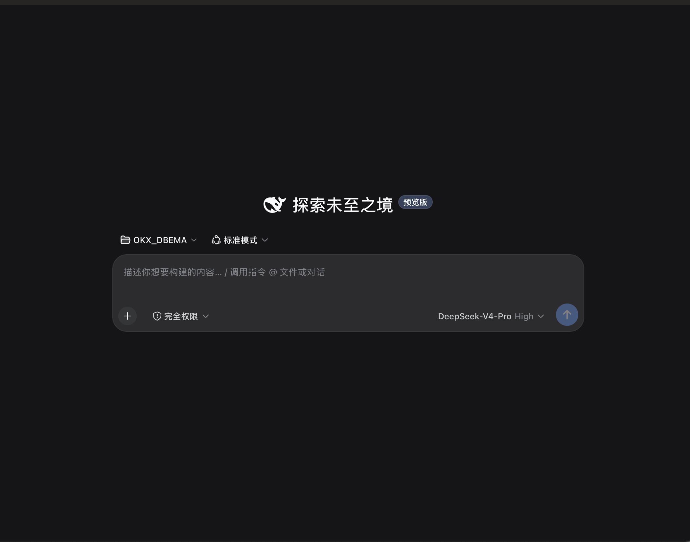

# DeepSeek Harness for macOS

<p align="center">
  
</p>

<p align="center">
  <strong>把 DeepSeek Harness 带到 macOS 桌面。</strong><br />
  一个开源、原生、开箱即用的桌面启动器。
</p>

<p align="center">
  <a href="https://github.com/engty/deepseek-harness-macos-launcher/releases">下载 Releases</a>
  ·
  <a href="https://github.com/deepseek-ai/deepseek-harness">查看官方 Harness</a>
</p>



## 为什么使用

- **双击即用**：Node.js、pnpm 与 Harness Runtime 由 App 管理，不必手动配置终端环境。
- **原生桌面体验**：官方 Web UI 运行在本机，并放进 macOS 原生窗口；菜单栏可管理密钥、插件和 Runtime。
- **插件生态保持兼容**：继续使用官方插件命令，支持插件安装、停用、卸载和缓存清理。
- **本机优先**：运行时与用户数据保存在 App 的私有目录，减少对系统全局环境的影响。
- **1024 Store 深度适配**：商店页面保留在 App 内，安装和卸载交给启动器统一确认、检测和回滚；商店自身不会偷偷更新核心组件。
- **升级更稳**：Runtime 和插件变更先在候选目录完成，再通过真实启动检查后切换，失败时保留原来的可用环境。
- **开发预览友好**：面向快速试用和迭代中的 Harness 版本，保留官方能力与更新路径。

## 插件与运行环境

启动器为 Harness 和插件创建独立的 App 私有运行环境，统一管理 Node.js、pnpm、npm/npx、插件目录和缓存。插件安装不会修改用户的 Shell 配置、系统 PATH 或全局 npm/pnpm 包；只有用户明确确认后，才会执行插件自身可能包含的构建脚本。

内置的 1024 Store 使用经过审查的启动器适配层：网页只提交受限的安装意图，原生部分负责校验命令、显示确认、安装到候选 profile、重新应用兼容桥接并进行启动预检。这样既保留官方商店的目录和浏览体验，也避免插件直接改写正在运行的环境。适配细节见 [dsh1024 启动器适配说明](docs/dsh1024-launcher-adapter.md)。

## 安装

1. 打开 [Releases](https://github.com/engty/deepseek-harness-macos-launcher/releases)，下载最新 macOS 安装包。
2. 打开 DMG，将 **DeepSeek Harness.app** 拖入 **Applications** 文件夹。
3. 首次启动若被 macOS 拦截，请在 Finder 中右键 App，选择“打开”。
4. 在 App 菜单中配置 DeepSeek API Key，然后开始使用。

项目面向 macOS 13 或更高版本，优先支持 Apple Silicon。具体系统兼容性以发布页说明为准。

## 代码来源

本项目是独立的开源 macOS 启动器，不是 DeepSeek 官方产品，也不代表 DeepSeek、OpenAI
或任何第三方插件作者。

- **官方运行时与 Web UI**：来自 [deepseek-ai/deepseek-harness](https://github.com/deepseek-ai/deepseek-harness)，遵循其 MIT 许可证。
- **macOS 启动器**：本仓库中的 Swift、SwiftUI、AppKit 和 WebKit 代码，遵循本项目的 MIT 许可证。
- **1024 Store**：基于 [awesome-deepseek-harness-plugins](https://github.com/imsai-sh/awesome-deepseek-harness-plugins/tree/main/packages/dsh1024)，启动器内置的适配文件只负责 macOS 环境隔离、安装事务和自更新控制。
- **桌宠适配**：基于 [better-dsh-pet](https://github.com/ysppwn721/better-dsh-pet) 及其公开 macOS 适配工作。
- **记忆与其他插件**：通过 Harness 官方插件机制接入，来源、许可证和服务条款由各自上游项目负责。

所有第三方组件与来源记录见 [THIRD_PARTY_NOTICES.md](THIRD_PARTY_NOTICES.md)。

## 隐私与安全

- API Key 只保存在本机的 macOS Keychain 与 Harness 私有凭据目录，不写入本仓库，也不会随发布包上传。
- Harness 默认只监听本机地址；只有用户主动点击的外部链接才会交给系统浏览器。
- 插件属于第三方代码，安装前请确认来源可信，并按其项目说明使用。

## 开发

```bash
swift test
node --test Tests/dsh1024-adapter.test.mjs
./script/build_and_run.sh --build-only
```

构建脚本会使用本地 Swift 工具链生成并校验 macOS App；发布与签名流程见仓库中的脚本和第三方声明。完整的插件依赖边界见 [插件依赖管理方案](docs/plugin-dependency-management.md)。

## 许可证

本项目使用 [MIT License](LICENSE)。第三方组件仍受其各自许可证约束。
