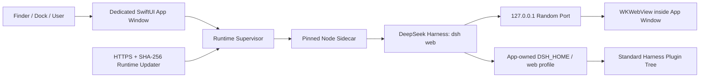
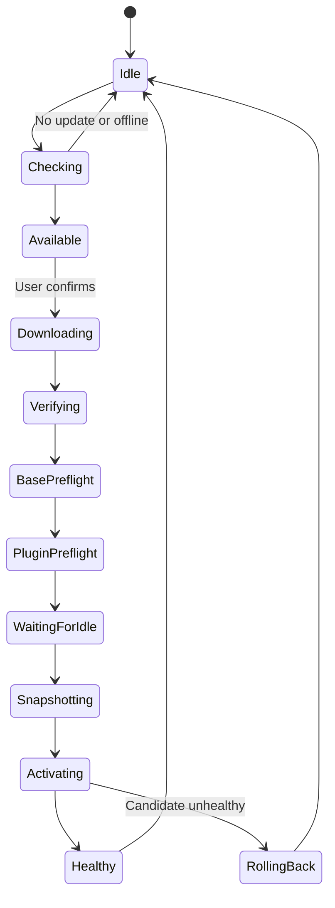

# DeepSeek Harness for macOS 产品需求文档

> 工作名称：DeepSeek Harness
>
> 文档状态：Draft — 可进入 Tech Spec 与开发拆解
>
> 文档版本：0.7
>
> 更新日期：2026-08-15
>
> 目标平台：macOS 13+，Apple Silicon 与 Intel 分架构发布
>
> 分发方式：受控渠道直接分发 App/ZIP；本项目只提供本地 ad-hoc 签名，不承诺 Gatekeeper、公证或 Mac App Store 分发
>
> 产品定位：DeepSeek Harness 的非官方 macOS 启动器与运行时管理外壳

## 0. 结论摘要

本产品不是重新开发一套类似 DeepSeek Harness 的客户端，而是把官方 `dsh web` 完整包装成可双击启动的 macOS App。

App 只承担以下职责：

1. 内置并启动兼容版本的 Node.js、DeepSeek Harness 和必要依赖。
2. 在原生窗口中加载 Harness 原有 React Web UI。
3. 监督 Harness 进程的启动、停止、崩溃恢复和日志。
4. 更新 App Shell 和底层 Harness Runtime。
5. 保持 Harness 官方插件协议、profile 和插件树兼容。
6. 在 macOS 顶部应用菜单中安装、卸载和停止已安装的标准 Harness 插件，包括 `dsh-llm-codex`。

聊天、会话、模型选择、工作区、权限、工具调用、设置和普通插件呈现全部由 Harness 原生 UI 负责。App 不复制这些页面，不维护第二套业务状态，也不发明私有插件格式。

当前实现采用 SwiftUI/AppKit 薄外壳和 `WKWebView`。Swift 主进程启动独立 Node sidecar，执行固定版本的 `dsh --profile web --host 127.0.0.1 --port 0`，等 Harness 就绪后再把 loopback UI 加载到专用 App 窗口中的 WebView。该窗口没有地址栏和浏览器导航控件；启动、重启或更新 Harness 都不得调用 Safari、Chrome 等系统浏览器打开主界面。系统浏览器只可用于用户主动点击的外部文档或必须由外部浏览器完成的 OAuth 登录。若后续 WebKit 与 Harness client plugin 出现无法接受的兼容差异，再评估 Electron 作为替代外壳。

更新应拆成两个主要层级：

- **App Shell 更新**：SwiftUI/AppKit 主程序和辅助程序，低频发布；本项目不实现 Developer ID、公证或 Shell 自动更新。
- **Harness Runtime 更新**：Harness、Node 和生产依赖组成不可变 Runtime Bundle，可高频发布，下载后经过 HTTPS、SHA-256、实际用户插件树兼容预检和失败回滚再激活。Runtime feed 不使用公钥签名，属于受控发布源信任模型。

不建议客户端直接 `git pull`、拉源码或现场执行 Harness 主程序的 `pnpm install`。上游源码或 npm 包应由受控构建流程构建成经过测试的 Runtime Bundle，再交付客户端。只有用户明确发起的标准第三方插件安装、更新或删除，才在 App 私有 profile 中调用官方 `dsh plugin --profile web ...` 命令。

`dsh-llm-codex` 不需要集成进 App Shell，也不需要默认捆绑源码。它应与其他第三方插件一样，通过标准 `dsh plugin --profile web add dsh-llm-codex` 安装到 App 私有 profile。Launcher 的 Plugins 菜单动态列出已安装插件并提供 Start/Stop；因此安装该插件后自然出现对应菜单项，不需要为它维护专用业务代码。Start/Stop 通过启用或禁用该 bundle 并优雅重启 Harness 生效；插件运行后，其模型由 Harness 原有模型选择器展示。App 不新增 Codex Provider 页面或模型列表页面。

## 1. 产品定义与边界

### 1.1 一句话定义

DeepSeek Harness = DeepSeek Harness 官方 Web UI + 受监督的本地 Runtime + macOS 原生启动/菜单/更新外壳。

本项目只包含三个产品组件：

1. **Launcher**：双击启动 App、创建专用窗口并承载 Harness Web UI。
2. **Plugin Manager**：通过官方 CLI 在 App 私有 profile 中安装、卸载和停止插件。
3. **Process Maintainer**：维护 Harness sidecar 的启动、停止、崩溃恢复、版本检测和 Runtime 升级。

余额显示、诊断导出和更新提示都是上述三个组件的薄辅助能力，不形成独立业务系统。

### 1.2 App 负责什么

- Finder、Dock 和 Spotlight 双击启动。
- 窗口、应用菜单、单实例和退出行为。
- 固定且可复现的 Harness Runtime。
- loopback 端口、进程生命周期和崩溃恢复。
- App Shell 与 Harness Runtime 更新。
- App 私有 `DSH_HOME` 和插件 profile。
- 标准插件安装/卸载命令的薄封装与兼容预检。
- 已安装标准插件的通用菜单安装、卸载和停止；`dsh-llm-codex` 只是其中一个实例。
- 启动和更新失败时的最小原生错误/恢复界面。

### 1.3 App 不负责什么

- 不重写 Harness 的聊天、设置、模型、插件清单或会话页面。
- 不建立 App 自有 Provider 数据模型。
- 不代理正常的 Harness API 请求或工具调用。
- 不把 Harness 插件改造成 App 插件。
- 不提供私有插件市场、插件格式或插件 SDK。
- 不承诺第三方插件安全、无 Bug 或永远兼容；插件协议和插件自身的兼容性由 Harness 上游及插件作者负责。
- 不负责全量插件兼容矩阵、第三方 Provider canary 或第三方插件许可证审计；Launcher 只验证当前 Runtime 与当前用户插件树的启动兼容性，并展示包元数据供用户判断。
- 不在客户端从 Git commit 编译 Harness。

### 1.4 单一事实来源

| 内容 | 单一事实来源 |
|---|---|
| 会话、工作区、模型、工具、设置 | Harness Runtime 与 `DSH_HOME` |
| 插件依赖与 lockfile | `$DSH_HOME/profiles/web` |
| 当前 Shell 版本 | macOS App bundle |
| 当前 Runtime 版本 | App 的 Runtime manifest |
| 已安装插件的期望启停状态 | App 管理的 profile overlay |
| 更新通道与检查时间 | App launcher settings |

## 2. 源码审阅结论

### 2.1 审阅快照

| 项目 | 审阅版本 | 关键事实 |
|---|---|---|
| `deepseek-ai/deepseek-harness` | commit `47f943859bef60e4160492346772ded9b24f765a`；npm `@deepseek-ai/dsh@0.1.0-rc.6` | Developer Preview；已有完整 React Web UI；`dsh web` 默认在 loopback 提供服务；版本可能包含破坏性变化 |
| `yequ172672/dsh-codex-subscription` | commit `0da1d13d0ef7d694e714306d5cf8b65d0078d09c`；npm `dsh-llm-codex@0.1.1` | 标准 `dsh.bundle.patch` 插件；读取 Codex 登录凭证；注册 `codex` Provider；动态发现订阅模型 |
| OpenAI Codex | 2026-08-15 官方文档快照 | Codex CLI 支持 ChatGPT 计划登录和 API Key；凭证可能存放在 `auth.json` 或系统 Keychain |

### 2.2 DeepSeek Harness 当前能力

- `npx @deepseek-ai/dsh web` 已提供完整 UI，不需要 App 重写前端。
- `dsh web --port 0` 支持由操作系统分配空闲端口，适合 Launcher 监督启动。
- Web Host 默认使用 loopback，并校验 `Host`、`Origin` 和 WebSocket upgrade。
- `SIGTERM` 是上游正常停止路径，可触发插件树和持久化资源清理。
- `DSH_HOME` 可以把全部 Harness 数据和 profile 定向到 App 私有目录。
- 上游文档仅预留 Electron IPC carrier 方向；当前仓库没有可直接使用的 Electron shell。
- Harness UI 中当前插件清单是只读视图，没有完整安装或升级功能。
- `dsh plugin --profile web ...` 是官方插件管理入口，会在 profile 中调用 pnpm，并把声明 `dsh.bundle.patch` 的依赖 reconcile 到 `dsh.profile.bundles`。
- Web profile 会加载 Host plugin 与 browser client plugin；保持官方 loopback Web carrier 是第三方插件兼容性最稳妥的首版方案。

结论：上游 UI 本身没有可直接复用的 Harness Runtime 自动升级能力，也没有完整图形化插件管理器。Launcher 必须负责 Runtime 更新；插件则继续走官方命令和 profile，不另造协议。

### 2.3 `dsh-llm-codex` 当前能力

- 以标准 Harness bundle patch 安装和加载。
- 读取 `CODEX_HOME/auth.json` 或 `~/.codex/auth.json`。
- 支持 ChatGPT 登录 token，并兼容 OpenAI API Key 形态。
- ChatGPT 模式调用 Codex backend Responses SSE 接口。
- 模型目录按“实时接口 → Codex 本地缓存 → 静态列表”回退。
- 可转换 reasoning、text、tool call 和 usage。
- 当前为 text-only，图片输入不受支持。

### 2.4 `dsh-llm-codex` 推荐安装前阻塞项

| 编号 | 问题 | 影响 | 发布要求 |
|---|---|---|---|
| C-01 | 使用的 ChatGPT/Codex backend wire 不是公开稳定的 OpenAI Platform API 契约 | 协议可能变化；存在条款和品牌风险 | 由 `dsh-llm-codex` 仓库和其发布方负责；Launcher 只按标准插件协议加载，不维护 Provider canary |
| C-02 | 携带凭证的 fetch 默认跟随重定向 | token 或请求内容可能被转发到其他 origin | 使用 `redirect: 'error'` 并增加回归测试 |
| C-03 | 默认直接读写全局 `~/.codex/auth.json` | 与 Codex CLI 并发冲突；Agent 可能读取凭证文件 | 使用 App 专属 `CODEX_HOME` 或安全凭证桥接；不默认改写全局文件 |
| C-04 | 临时凭证文件未显式固定 `0600` | 文件权限可能过宽 | 所有凭证文件强制 owner-only，且不得进入诊断包 |
| C-05 | `writeBack:false` 刷新结果没有被正确用于重试 | token 刷新后仍可能继续失败 | 修复内存重试并覆盖单元测试 |
| C-06 | 静态模型兜底可能过期或与账户权限不符 | 显示不可用模型 | 以实时账户目录为准，仅保留带时间戳的 last-known-good cache |
| C-07 | 缺少完整单元、契约和 CI 测试 | 上游协议变化难以及时发现 | 由 Harness/插件上游建立；Launcher 仅覆盖自身启动、插件事务和候选预检 |
| C-08 | 代理错误可能暴露含凭证的 URL | 日志泄密 | 统一 URL credential redaction |
| C-09 | npm manifest 声明 MIT，但仓库根目录缺少 `LICENSE` 文件 | 将其随 App 再分发时证据不足 | App 不捆绑或再分发插件源码；安装前展示发现到的 license 元数据，用户自行承担安装决策 |
| C-10 | 精确绑定 Harness RC 依赖 | Runtime 高频升级可能破坏插件 | Launcher 对当前实际插件树做候选预检；协议和插件版本矩阵由 Harness/插件上游维护 |

## 3. 产品目标、非目标与成功指标

### 3.1 核心目标

1. 用户双击 App 即进入完整 Harness UI，无需安装全局 Node、pnpm 或 `dsh`。
2. App 的行为尽量等同同一版本的官方 `dsh web`。
3. 用户使用 Harness 原生 UI 完成聊天、模型配置、工作区和日常操作。
4. App 能发现来自受控 HTTPS feed 的 Harness Runtime 更新，并在用户确认后安全升级。
5. Runtime 更新失败时自动恢复 last-known-good，且不损坏会话、设置或插件 profile。
6. 符合目标 Harness 版本标准协议的插件，可以用官方安装方式加入 `web` profile；Launcher 提供安装、卸载和停止。
7. `dsh-llm-codex` 作为普通标准插件运行，不建立专用集成。

### 3.2 非目标

- 重做 Codex 风格的聊天 UI；外观和交互由 Harness 原生 UI 决定。
- App 自有 onboarding、Provider 设置页、模型目录页或插件市场。
- 修改第三方插件的公开安装协议。
- 自动升级用户自行安装的第三方插件。
- 从任意上游 commit 直接向终端用户推送未经验证的版本。
- 在 Mac App Store 发布。
- 允许 LAN 或公网访问本机 Harness Host。
- 向用户承诺未由其账户实时返回的 OpenAI 模型一定可用。

### 3.3 成功指标

| 指标 | 目标 |
|---|---|
| Warm start 到 Harness UI 可操作 | P95 ≤ 5 秒 |
| Cold start 到 Harness UI 可操作 | P95 ≤ 15 秒，不含首次 Runtime 下载 |
| App 启动成功率 | ≥ 99.5% |
| Runtime 更新激活成功率 | ≥ 99%；失败自动回退 |
| 更新后用户数据可访问率 | 100%；不允许静默丢失 |
| 标准插件兼容回归通过率 | Launcher 自身协议/事务/预检测试 100%；不承诺全量第三方插件覆盖 |
| 凭证出现在 Web 内容、日志或诊断包中 | 0 次 |
| 需要终端才能完成日常 Harness 使用 | 0；高级插件 CLI 除外 |

## 4. 用户故事

1. 作为用户，我从 Finder 双击 App 后可以直接使用 Harness。
2. 作为用户，我关闭窗口后仍可让正在运行的任务继续，点击 Dock 可重新打开窗口。
3. 作为用户，我能从应用菜单检查 App 和 Harness Runtime 更新。
4. 作为用户，我确认更新前能看到版本、变更摘要、已知兼容问题和是否需要重启。
5. 作为用户，新 Runtime 与我的插件不兼容时，我可以继续使用当前 Runtime。
6. 作为用户，我能以 npm、git、tarball 或本地路径 spec 使用 Harness 官方方式安装插件。
7. 作为用户，安装后的 Host、Tool、Provider、设置扩展和 browser client plugin 能在 App 中工作。
8. 作为用户，我安装插件后，可以从 macOS 通用 Plugins 菜单卸载或停止，不进入额外 App 页面。
9. 作为用户，启动、插件或更新失败时可以导出不含 secret 的诊断信息。

## 5. 技术方案

### 5.1 采用 SwiftUI + WKWebView 薄外壳

| 方案 | 优点 | 主要问题 | 结论 |
|---|---|---|---|
| SwiftUI + WKWebView + Node sidecar | 原生 macOS 窗口；体积较小；启动器职责清晰；可直接使用 AppKit 生命周期和菜单 | WebKit 与 Chromium 存在行为差异，需要真实 Harness/plugin smoke | **采用** |
| Electron + Node sidecar | 与 Harness React/Node 栈一致；Chromium 兼容性高；更新和窗口能力成熟 | 体积更大；需要额外 Electron renderer 安全边界 | 作为兼容性备选 |
| Tauri + Node sidecar | Shell 较小 | 仍需 Node；增加 Rust 和 WebView 差异，不能减少核心复杂度 | 不采用首版 |
| 重写原生 UI | 完全原生 | 持续复制快速变化的 Harness UI 和协议 | 不采用 |

### 5.2 运行架构



### 5.3 为什么首版继续使用 loopback Web carrier

- 这是当前上游已经运行和测试的路径。
- Host API、WebSocket、前端 dist 和 browser client plugin 不需要改造。
- 可以最大限度保持与 `dsh web` 行为一致。
- 上游 Electron IPC carrier 尚无可直接复用实现；若 WebKit smoke 暴露不可接受的 client plugin 差异，Electron 可作为独立替代方案。

未来只有在上游 carrier 稳定、且安全或性能收益可量化时，才评估 IPC 替代；它不属于 MVP。

## 6. 功能需求

### 6.1 App 生命周期

#### APP-001 双击启动

- `.app` 可从 Finder、Dock 或 Spotlight 启动，不弹出终端窗口。
- 启动 App 不得调用系统默认浏览器；Harness 主界面只能显示在 App 自有窗口中。
- 使用 single-instance lock；第二次启动只聚焦当前窗口。
- Shell 启动后读取 active Runtime 和 active data slot。
- 在 Harness ready 前显示简洁启动状态，不显示空白窗口。

#### APP-002 Harness 启动

- 使用 App 提供且版本固定的 Node 可执行文件。
- 执行 `dsh --profile web --host 127.0.0.1 --port 0`。
- `DSH_HOME` 指向 App 当前数据 slot，不使用全局 `~/.dsh`。
- 优先使用 Runtime 自带 Node/pnpm；仅在插件依赖需要时按兼容回退规则使用用户已有 pnpm，不覆盖用户 PATH 或 Shell 配置。
- Supervisor 仅在解析到 readiness URL 且健康检查通过后加载专用窗口中的 WKWebView。
- readiness 超时、进程提前退出或端口不可达时显示最小原生恢复页。

#### APP-003 Harness 停止

- App 退出、Runtime 更新和插件启停都走同一优雅停止流程。
- 先阻止新任务，再发送 `SIGTERM`，等待 Harness flush session 并卸载插件。
- 超时后才强制结束进程，且必须记录脱敏原因。
- 若存在活跃任务，默认等待空闲；用户强制退出时明确提示任务会被中断。

#### APP-004 崩溃恢复

- sidecar 异常退出时保留窗口并展示 Restart Harness。
- 自动重启使用有限退避，避免 crash loop。
- 连续三次启动失败后尝试 last-known-good Runtime 与对应 data slot。
- 恢复流程不得自动删除用户数据、插件或工作区信息。

#### APP-005 macOS 应用菜单

标准菜单至少包含：

- About DeepSeek Harness。
- Show Harness Window。
- Check for Updates…。
- Restart Harness。
- Plugins。
- Hide、Close Window、Quit。

App 不提供独立业务 Settings 窗口。少量 Launcher 偏好，如更新通道和自动检查，可使用原生小型偏好面板或菜单项；Harness 业务设置仍在同一个 App 窗口中打开 Harness 原生设置页。

#### APP-006 顶栏折扣与 Runtime 更新提示

- 顶栏不显示 Harness Runtime 状态标题、运行圆点或官方版本号；右上角保留余额数值入口。
- 正常状态下，右上角显示用户提供的折扣图标、折扣倍率和余额。
- 折扣时间固定按北京时间（`Asia/Shanghai`）计算：周一至周五 09:00–12:00、14:00–18:00 为高峰时段，显示灰色 `折扣 1.0x`；其余时间为闲时，显示绿色 `折扣 0.5x`。界面至少每 30 秒重新计算一次，不触发 Harness Web UI 刷新。
- 检测到来自受控 HTTPS feed、且 artifact SHA-256/架构/路径检查通过的新 Runtime 时，右上角显示小圆形下载图标；官方版本号和运行状态仍不显示，折扣和余额入口保持可见。用户点击后下载并校验 artifact，确认后优雅停止、执行候选 Runtime 启动检查并原子切换；不能覆盖运行中的 Runtime。
- DeepSeek API Key 通过 `设置 → 更换 DeepSeek API 密钥…` 菜单配置；Key 只保存到 macOS Keychain 和 Harness 标准凭据文件，不进入 WKWebView、Harness 页面、日志、诊断包或更新 manifest。
- 余额请求使用 DeepSeek 官方 `GET https://api.deepseek.com/user/balance`，通过 `Authorization: Bearer <TOKEN>` 查询 `balance_infos`；配置完成后立即查询一次，随后每 60 秒最多查询一次。余额查询错误只更新内部状态，不影响 Harness 会话和任务。
- API Key 对话框提供“充值”按钮，打开 DeepSeek 官方充值页面；余额在顶栏显示，不提供手动刷新按钮。

### 6.2 Harness UI 承载

#### UI-001 原样复用

- WKWebView 加载当前 Runtime 自带的官方 Harness frontend dist。
- 专用 App 窗口使用标准 macOS 窗口外观，不显示 URL、地址栏、标签页、前进/后退或其他浏览器控件。
- Harness 主界面不得通过 `shell.openExternal`、`open` 命令或默认浏览器启动。
- 不使用复制页面、公共网站 iframe 或二次实现的聊天 UI。
- Harness 的会话、侧边栏、模型选择、设置、工具调用、工作区和插件清单保持原有行为。
- Launcher 不注入会改变 Harness 业务行为的 DOM 脚本。

#### UI-002 WKWebView 安全基线

- Web 内容不桥接任意 Swift 原生对象，也不获得通用 filesystem、shell 或 process 能力。
- 禁止导航到当前 Harness loopback origin 之外。
- `window.open` 默认拒绝；用户主动点击的 allowlist HTTPS 文档链接或 OAuth 登录可交给系统浏览器，但不得把 Harness 主界面交给系统浏览器。
- 生产版 Web Inspector 默认关闭。

#### UI-003 Harness 原生设置入口

- App 菜单中的 Harness Settings 只负责聚焦/导航到 Harness 已有设置页。
- Launcher 不保存 Harness Provider、模型或工具配置副本。
- 若上游设置路由变化，Launcher 应退化为打开主窗口，而不是阻止启动。

### 6.3 标准 Harness 插件兼容

#### PLG-001 兼容承诺

如果一个插件能在相同 macOS 架构、相同 Harness Runtime 版本和官方 `web` profile 下正确安装并运行，Launcher 应允许它以相同方式运行。

兼容范围包括：

- `dsh.bundle.patch` 和 profile layer。
- Host plugin。
- Tool、Provider 和设置扩展。
- browser client plugin 与其前端模块。
- 同一插件的 Host + client 双面组合。

该承诺是协议兼容，不是第三方插件质量或安全担保。

#### PLG-002 标准安装方式

- 唯一安装语义为上游 `dsh plugin --profile web add <plugin-spec>`。
- 卸载使用官方 `remove` 子命令；插件版本升级不属于 Launcher UI 的承诺范围。
- 优先使用 Runtime 随附且锁定版本的 pnpm；为兼容用户已有插件环境，保留用户 pnpm 作为子进程回退，不修改其全局配置。
- 支持范围与上游 pnpm spec 保持一致，包括 registry package、git、tarball 和本地 `file:`/`link:` 路径。
- Launcher 以参数数组调用命令，禁止拼接 shell 字符串。
- App 不定义额外 plugin manifest，也不改写第三方包的 `dsh` 字段。

#### PLG-003 安装入口

为保持 Launcher 定位，首版只提供两个薄入口：

1. macOS `Plugins > Install Plugin…`：粘贴官方安装命令（例如 `dsh plugin --profile web add dsh-llm-codex`），Launcher 只解析官方参数，不经过 shell，确认来源后调用官方命令。
2. App 随附的高级 helper CLI：原样转发 `plugin --profile web ...`，便于自动化和本地插件开发。

Harness 内的只读插件清单继续用于查看最终加载结果。Launcher 不开发插件市场或另一套插件管理页面。

#### PLG-004 事务与失败恢复

- 安装和删除先复制当前 `web` profile 到 staging data slot。
- 在 staging 中运行官方插件命令、bundle reconcile、`--dump-config` 和隐藏候选启动。
- 只有候选 Harness 启动并完成 Host/UI smoke 后，才停止当前 Runtime 并原子切换 data slot。
- 任一步失败都继续使用原 profile，并展示脱敏错误。
- 原 profile、`package.json`、lockfile 和已解析版本至少保留一个可恢复版本。
- 安装包要求执行 lifecycle/build script 时，必须显示来源和风险并取得用户确认。

#### PLG-005 插件持久化

- 用户插件属于 data slot，不写入只读 Runtime 目录。
- 插件的 profile、lockfile、`node_modules`、bundle patch 和配置随用户数据保存。
- App 重启不得重新解析或静默更新插件依赖。
- Runtime 更新时，候选 data slot 从当前用户插件树 clone，而不是恢复成空 profile。
- 本地路径插件保持用户选择的路径语义；路径失效时明确报错，不复制成未知版本。

#### PLG-006 Runtime 更新兼容预检

- 新 Runtime 必须用用户实际插件树的 clone 进行 `--dump-config` 和候选启动。
- 兼容插件保持原已解析版本和 lockfile，不因 Runtime 更新被静默升级。
- 出现不兼容插件时阻止自动激活，并列出插件名、当前版本和失败阶段。
- 用户可选择保留旧 Runtime、取消更新，或在候选 slot 中明确停用不兼容插件。
- Launcher 不得静默删除、替换或更新第三方插件。

#### PLG-007 插件信任边界

- Harness 插件是与本地 Host 同权限运行的代码，不是受 WKWebView Web 内容 sandbox 限制的浏览器扩展。
- 安装前展示请求 spec、解析来源、版本、许可证信息和是否包含 lifecycle scripts。
- registry/git/tarball/本地路径均视为不可信供应链输入。
- “安装预检通过”只代表兼容，不代表插件安全。

#### PLG-008 默认捆绑 dsh1024

- Runtime 发布包内置一个经过构建时锁定的默认 `web` profile，当前包含 `dsh1024@0.5.0`。
- 首次启动时，若 App 私有 `DSH_HOME` 尚不存在 web profile，Launcher 将复制该默认 profile；复制完成后按标准 Harness profile 运行，不引入私有插件协议。
- 已存在的用户 profile 永远不被默认模板覆盖。用户通过标准卸载命令移除 `dsh1024` 后，重启不会静默装回。
- 默认 profile 随 Runtime 构建生成，不在用户机器上修改全局 Node、pnpm、Shell 或包目录；后续版本升级通过新的 App/Runtime 构建更新默认模板。
- `dsh1024` 的 Host、bundle patch 和 web client 注入仍由 Harness 原生插件机制加载；Launcher 只负责首次 profile 种子和专用窗口的已声明嵌入源。

### 6.4 已安装插件的通用菜单管理

#### PLM-001 零专用集成

- Swift Launcher 主进程不导入、链接或复制任何第三方插件源码。
- Launcher 从 active `web` profile 读取已安装插件和停止状态，动态生成菜单。
- `dsh-llm-codex` 只是一个标准插件，不建立专用 App 模块。
- 未安装 `dsh-llm-codex` 时，App 不显示它的专属菜单项；用户可通过 `Install Plugin…` 输入其标准 package spec 安装。
- App 只记录当前实际安装包的来源、版本和风险元数据，不把记录扩展为全量兼容承诺。

#### PLM-002 菜单结构

macOS 顶部应用菜单动态使用以下结构，不在 Harness UI 中新增页面：

```text
  插件
  安装插件…
  停用插件…
  卸载插件…
  清理插件缓存…
  已安装插件
    dsh-llm-codex
      状态：已停用 | 启动中 | 运行中 | 停止中 | 错误
      启用插件
      停用插件
```

- `Installed Plugins` 只列出实际 `dsh.profile.bundles` 中的顶层 bundle，不把传递依赖误显示成可独立启停的插件。
- 菜单内容来自实际 profile，不使用 App 硬编码列表。
- Status 为只读菜单项。
- 已安装且未被停止的插件随 Harness 启动；Stop 仅在 Running/Starting 时可用。
- Resume 只用于撤销此前的 Stop，不引入另一套插件启动协议。
- 停止状态保存在 profile overlay；恢复运行使用 Launcher 的恢复操作或重新安装/重建 profile，不卸载插件数据。
- 错误详情使用最小原生 alert 或诊断入口，不创建 Provider 管理页面。

#### PLM-003 安装、卸载和停用交互

- 安装输入框接受用户复制的标准安装命令；Launcher 只允许 `plugin --profile web add`，拒绝 shell 操作符和 pnpm 任意选项。
- 卸载和停用打开当前实际插件列表，支持单选、多选和全选；用户确认后一次性执行对应操作。
- 卸载执行官方 `dsh plugin --profile web remove <name...>`，保留 Harness 会话和其他用户数据。
- 卸载完成后清理 App 可确定归属的插件缓存，并在用户确认范围内执行 `pnpm store prune` 回收共享 pnpm 缓存；不盲删其他应用的配置目录。
- 停用不删除依赖、不修改插件源码，只生成官方支持的 patch overlay，将所选 bundle patch row 标记为 `disabled: true`，然后重启 Harness。
- 如果某个插件没有可识别的 bundle patch row，Launcher 不提供停用操作并提示用户；不尝试猜测或编辑第三方包。
- “清理插件缓存”显示各插件可识别的 App 缓存大小，并提供共享 pnpm 缓存和安装暂存缓存的单独条目，支持单选、多选和全选。

#### PLM-004 Stop Plugin

1. 将目标插件的期望状态标记为 Stopped。
2. 若存在使用该插件的活跃任务，默认等待任务结束，不直接中断。
3. 在 profile overlay 中禁用目标 bundle。
4. 优雅重启 Harness 并确认目标能力不再注册。
5. 不卸载插件、不删除插件配置、凭证或历史会话。

#### PLM-005 关键语义

Harness bundle 通常不是独立 daemon，因此 Stop 不是结束独立插件进程，而是改变 Harness 插件树并重启 Runtime。已安装且未被 overlay 禁用的插件随 Harness 启动；若未来某个插件确实管理独立进程，应由插件自身的标准生命周期负责，Launcher 仍不引入插件专用控制协议。

#### PLM-006 `dsh-llm-codex` 的自然行为

- 使用标准命令安装：`dsh plugin --profile web add dsh-llm-codex`。
- 安装后自动出现在通用 Plugins 菜单和 Harness 原生插件清单中，并随 Harness 启动。
- Running 且认证有效时，Harness 原生模型选择器展示账户实时返回的模型；Launcher 不维护模型列表。
- 凭证缺失或认证错误由 Harness/插件原生 UI 呈现，Launcher 菜单不解析 Provider 私有认证状态。
- Launcher 不维护静态 OpenAI 模型列表，也不新增 Codex Provider 页面。
- 未认证、模型目录失败或账户无权限时，不伪造可用模型。
- ChatGPT 订阅计费与 OpenAI Platform API 计费必须明确区分。

### 6.5 最小诊断与恢复

#### DIA-001 原生恢复页

只在 Harness 无法加载时展示，包含：

- 当前 Shell、Runtime、Node 和已安装插件版本。
- 启动失败阶段与脱敏错误码。
- Restart Harness。
- Use Last-known-good Runtime。
- Export Diagnostics。
- Check for Updates。

#### DIA-002 诊断包

可以包含：

- 版本、架构、macOS 版本和 Runtime manifest。
- 最近有限数量的 supervisor 日志。
- hash 校验结果。
- 脱敏后的 `--dump-config` 结构摘要。
- 插件名、解析版本和启动阶段。

禁止包含：

- `.env` 内容、API Key、token、`auth.json` 或 Keychain 内容。
- 代理用户名和密码。
- 会话正文、工作区文件内容或模型请求/响应 body。
- 未经用户选择的完整本地路径。

## 7. 自动更新设计

### 7.1 更新对象

| 对象 | 内容 | 默认策略 | 激活方式 |
|---|---|---|---|
| App Shell | SwiftUI/AppKit、supervisor、updater | Stable 低频自动检查，用户确认安装 | 重启整个 App |
| Harness Runtime | Node、Harness、frontend dist、生产依赖 | Stable 定期或 Preview 高频检查，用户确认激活 | 重启 Harness sidecar |
| Plugin Compatibility Metadata | 已测试插件版本范围和已知不兼容项，不包含插件源码 | 随 Runtime manifest 发布 | 不改变用户 profile |
| User Plugins | 用户通过标准方式安装的插件，包括 `dsh-llm-codex` | 不自动更新，只做兼容预检 | 用户明确执行官方插件 update |

### 7.2 推荐更新策略

- **Stable**：默认通道，建议每周聚合经过验证的上游版本；安全修复可立即发布。
- **Preview**：面向主动测试用户，可每日跟进上游，但仍必须完成构建和 Launcher 自身预检。
- App 启动并进入 Harness UI 后再异步检查更新，之后最多每 6 小时检查一次。
- Runtime artifact 检查使用受控 HTTPS manifest，不需要设备唯一 ID；manifest 不使用公钥签名，feed 管理权是主要信任边界。
- 当 artifact feed 尚未发布对应包时，Launcher 额外查询官方 npm 的 `@deepseek-ai/dsh` 最新版本，向用户提示官方版本变化，但绝不把普通 npm tarball 当作可安装 Runtime。
- 自动检查不等于自动激活；默认必须由用户确认。
- 可后台下载，但不得在活跃 Harness 任务中切换 Runtime。

### 7.3 为什么不在客户端直接更新源码

不采用以下方案：

- `git pull` 上游仓库。
- 下载任意 commit 后本机执行 build。
- 在当前 Runtime 目录执行 `pnpm update`。
- 直接覆盖 `.app/Contents` 内文件。

原因：这些方式不可复现，会执行未审核安装脚本，难以复现和回滚，并可能让 Harness、Node、前端和插件 ABI 处于半升级状态。

正确路径是：受控构建流程获取上游源码/npm 包 → 固定 Node/pnpm 与 lockfile → 构建双架构 Runtime Bundle → 运行 Harness/Launcher 预检 → 生成 SBOM/manifest → 发布到受控 HTTPS feed → 客户端验证 SHA-256、预检和原子切换。

### 7.4 Runtime Release Manifest

每个 Runtime manifest 至少包含：

```json
{
  "schemaVersion": 1,
  "runtimeId": "2026.08.15-rc.1-arm64",
  "channel": "stable",
  "architecture": "arm64",
  "harness": {
    "package": "@deepseek-ai/dsh",
    "version": "0.1.0-rc.6",
    "commit": "47f943859bef60e4160492346772ded9b24f765a"
  },
  "nodeVersion": "<pinned-version>",
  "observedPlugins": {
    "dsh-llm-codex": {
      "versions": ["0.1.1"],
      "status": "experimental"
    }
  },
  "minShellVersion": "0.1.0",
  "dataFormat": "<declared-format>",
  "artifact": {
    "url": "https://updates.example.com/runtime.tar.zst",
    "size": 0,
    "sha256": "<hex>"
  },
  "releaseNotesUrl": "https://updates.example.com/releases/<id>",
  "publishedAt": "2026-08-15T00:00:00Z"
}
```

`observedPlugins` 只是发布记录和提示信息，不是 Launcher 对第三方插件的完整兼容矩阵或 Provider canary 结果。

客户端不验证 manifest 公钥签名。HTTPS feed、artifact 大小、SHA-256、架构、归档路径检查和候选启动预检共同构成本产品的非签名更新信任模型。该模型不抵抗更新源或传输层被攻破，适合受控分发，不宣称具备供应链签名安全性。

### 7.5 更新流程



#### UPD-001 下载与校验

- 下载到 `~/Library/Caches/<bundle-id>/updates/staging`。
- 校验 HTTPS manifest、架构、Shell 最低版本、artifact SHA-256 和大小。
- 解压时拒绝绝对路径、`..` traversal、包外 symlink 和异常权限位。
- Runtime Bundle 不得包含指向构建机路径的依赖 symlink。
- 客户端不执行 Bundle 内 lifecycle script。

#### UPD-002 两阶段预检

1. **Base preflight**：在 throwaway `DSH_HOME` 中运行 `dsh --version`、`--dump-config`、Host readiness 和 UI boot smoke。
2. **Plugin preflight**：clone 当前真实 data slot，在候选副本中加载用户实际 `web` profile，重复 config/Host/UI smoke。

预检不调用真实模型、不读取模型请求内容，也不修改当前 active data slot。插件不兼容时显示兼容报告并停止激活。

#### UPD-003 数据 slot 与回滚

- Harness 当前仍为 pre-release，不能假设新旧数据格式总是兼容。
- 激活前 clone 当前 data slot；APFS 优先使用 copy-on-write clone。
- 新 Runtime 只写候选 slot，旧 Runtime 与旧 slot 保持 last-known-good。
- 候选通过 readiness、Host API 和 UI smoke 后才写入 active pointer。
- 启动失败自动恢复旧 Runtime 和旧 slot。
- 回滚后保留失败的候选 slot用于诊断，不静默删除其中新产生的数据。

### 7.6 Shell 更新

- 本项目不实现 App Shell 自动更新、Developer ID、Apple notarization 或 staple。
- 若未来需要更新 Shell，应另立发布方案；当前交付只保证受控渠道分发的 App Bundle 可启动。
- 可变 Runtime 位于 Application Support，不修改运行中的 `.app/Contents`。

## 8. Runtime 与数据布局

```text
~/Library/Application Support/<bundle-id>/
  state/
    launcher-settings.json
    active-runtime.json
    active-data-slot.json
  runtimes/
    <runtime-id>/
      manifest.json
      node/
      dsh/
      node_modules/
  data/
    <slot-id>/
      dsh-home/
        profiles/
          web/
  auth/
    codex-home/
  backups/
  diagnostics/

~/Library/Caches/<bundle-id>/
  updates/
  plugin-staging/

~/Library/Logs/<bundle-id>/
```

约束：

- `runtimes/<runtime-id>` 激活后只读。
- `data/<slot-id>/dsh-home` 是传给 Harness 的唯一 `DSH_HOME`。
- 用户插件与 lockfile 保存在 data slot，不放入 Runtime。
- App 专属 Codex auth 不放在 DSH_HOME、工作区或诊断目录。
- 长期 secret 优先进入 Keychain；必须使用文件兼容层时固定 `0600`。
- App 卸载不自动删除数据；删除本地数据必须是独立且二次确认的操作。

## 9. 安全与隐私

### 9.1 本地 Host 与 Renderer

- Host 只监听 `127.0.0.1` 随机端口。
- 不提供 `0.0.0.0`、LAN 或自定义 trusted host 开关。
- WKWebView 只访问本次 Harness 的 exact origin。
- WebKit 内容不桥接任意 Swift 对象；导航、外链和原生回调使用显式 allowlist。
- Launcher updater 和原生文件操作不得暴露给 Harness Web 内容或 Agent 工具。

### 9.2 Agent 与凭证边界

- 上游 sandbox 主要限制文件写入，不能被视为 secret 读取隔离或网络隔离。
- 进入推荐兼容列表的 Codex 插件版本不得把可读取的长期 token 暴露给 Harness 文件工具或 shell/subprocess。
- 优先使用 App 专属认证域和 credential broker/受控 authenticated transport。
- `danger-full-access` 下若无法保证凭证隔离，应阻止 Codex subscription plugin 启动并给出明确错误。
- 更新、诊断和日志逻辑必须统一脱敏 token、API Key、Cookie 和 proxy credentials。

### 9.3 第三方插件安全

- 第三方 Harness 插件是完整本地代码，可访问 Host 获得的文件和网络权限。
- WKWebView 页面隔离不能限制 Host plugin。
- 本地 staging、兼容 smoke 和 unsigned manifest 的 SHA-256 校验不等于第三方插件安全审计。
- App 必须在安装前提示来源和执行风险，不能使用“安全插件”等误导文案。

### 9.4 更新供应链

- Shell 和 Runtime 产物记录来源 commit/npm integrity、lockfile、构建环境和 SBOM。
- Runtime manifest 不使用 Ed25519 公钥签名；发布源必须通过受控 HTTPS 地址管理。
- 客户端拒绝错误架构、未知 schema、非法路径、大小不一致和 hash 不一致产物。
- 可通过更新 feed 移除有问题的 Runtime，或将已知危险插件版本标记为不兼容并阻止再次 Start，但不能远程卸载插件、改写用户 profile 或执行任意命令。

### 9.5 Telemetry

- Launcher 自有 telemetry 默认关闭，启用必须显式同意。
- Harness 自身 telemetry 继续遵循上游设置，Launcher 不复制其状态。
- 更新检查不发送设备唯一 ID。
- 若用户启用错误统计，只发送版本、平台、阶段和错误码，不发送 prompt、代码、路径或凭证。

## 10. 非功能需求

### 10.1 兼容性

- macOS 13 及以上。
- 分别发布 `darwin-arm64` 与 `darwin-x64`，不默认依赖 Rosetta。
- Runtime manifest 声明 Node engine、最低 Shell 版本和兼容插件组合。
- Launcher 行为应尽可能等同相同 Runtime 的官方 `dsh web`。

### 10.2 性能

- 正常启动不访问 npm registry，不重新解析插件依赖。
- 更新检查、下载和 hash 校验不阻塞 UI 线程。
- Runtime 日志限制大小并轮转。
- 主窗口关闭但任务继续时，sidecar 保持运行。

### 10.3 可靠性

- Runtime 启动、停止、插件启停、更新和回滚使用显式状态机。
- 不允许半安装 Runtime 或 plugin profile 成为 active。
- 磁盘不足、离线、代理失败、hash 失败和用户取消都有可恢复结果。
- 任何自动恢复都不得删除数据。

### 10.4 可维护性

- 不长期 fork Harness UI；必要补丁优先提交上游。
- Launcher 自有逻辑限于 shell、supervisor、updater、菜单和兼容适配。
- 维护 `compatibility-matrix.json` 作为 Shell、Harness、Node 和 Launcher 已验证组合的记录；不把它作为全量第三方插件兼容承诺。
- 每次上游升级自动生成依赖差异、API/ABI 契约结果和插件 fixture 报告。

## 11. 测试与验证计划

### 11.1 Unit Tests

- Supervisor 启停、readiness 解析、超时、crash loop 和 graceful shutdown。
- 动态插件菜单生成与通用 Start/Stop 状态机。
- 插件命令 argv 构造、spec 校验、profile staging 和原子切换。
- Runtime manifest schema、hash、版本和 channel。
- DeepSeek 余额响应解码、Keychain 保存和每分钟刷新状态。
- Archive traversal、symlink escape 和权限校验。
- data slot clone、active pointer 和 rollback。
- Codex adapter redirect、refresh、并发、proxy redaction 和模型目录缓存。

### 11.2 Harness 与插件集成测试

- 用真实 Runtime Bundle 启动 `dsh --profile web --port 0` 并加载 WKWebView。
- 创建工作区、会话、mock 模型消息与 mock 工具调用，重启后恢复。
- fixture 覆盖 Host-only、client-only、Host+client、Tool、Provider、设置扩展和 bundle patch。
- 安装来源覆盖 registry、git、tarball、本地 `file:` 与 `link:`。
- 插件安装失败、build script 拒绝、lockfile 冲突和本地路径失效均保持原 profile。
- browser client plugin 从同一 Harness origin 正常加载。
- 安装 `dsh-llm-codex` 后菜单自动出现；Start 后 Provider 注册，Stop 后 Provider 移除，历史数据保留。
- 活跃 Codex 任务期间 Stop 延迟到空闲。

### 11.3 更新测试

- 无更新、正常更新、取消、断网续传和代理失败。
- manifest 格式错误、artifact hash 错误、错误架构和未知 schema。
- 解压中断、磁盘不足、base preflight 失败和候选启动失败。
- 使用兼容与不兼容用户插件树执行 plugin preflight。
- 不兼容插件阻止激活且旧 Runtime 继续可用。
- 数据格式变化时使用独立 slot；回滚后旧会话和插件可访问。
- Shell 最低版本不满足时阻止 Runtime 激活。

### 11.4 发布验证

- arm64 与 x64 独立构建和干净账户启动。
- `codesign --verify --deep --strict`。
- 本项目不要求 `spctl --assess`、notarization 或 staple；受控分发由发布方自行处理 Gatekeeper 策略。
- 离线启动不依赖 npm、GitHub 或系统 Node。
- Runtime Preview/Stable 晋级、插件 Provider canary 和第三方许可证审核由对应上游/发布方负责，不属于 Launcher 验收范围。

## 12. 验收标准

### 12.1 Launcher MVP

- [ ] Finder 双击 App 后 15 秒内出现可操作的 Harness 原生 UI。
- [ ] Harness 主界面只显示在无地址栏的 App 专用窗口中，启动时不会打开 Safari、Chrome 或其他系统浏览器。
- [ ] 用户无需安装系统 Node、pnpm 或全局 `dsh`。
- [ ] sidecar 只监听 `127.0.0.1` 随机端口。
- [ ] App 退出使用 `SIGTERM` 停止 Harness 并保留会话。
- [ ] 关闭/重新打开窗口不会创建第二个 Runtime。
- [ ] WebView 不桥接任意 Swift 原生对象，导航和新窗口受限。
- [ ] 启动失败时可重启、回退和导出脱敏诊断。

### 12.2 标准插件兼容

- [ ] App 使用官方 `dsh plugin --profile web ...` 语义，不存在私有插件格式。
- [ ] registry、git、tarball、本地路径插件可以在 staging profile 中安装。
- [ ] Host、Tool、Provider、设置扩展和 browser client fixtures 均可加载。
- [ ] 插件安装失败不会改变 active profile。
- [ ] 插件命令完成后必须通过 `--dump-config` profile preflight 才能替换 active profile。
- [ ] App 重启和 Runtime 更新后，用户插件及 lockfile 保持不变。
- [ ] 新 Runtime 与用户插件不兼容时阻止激活，不静默删除或升级插件。

### 12.3 `dsh-llm-codex`

- [ ] App Shell 不包含该插件源码或专用业务模块。
- [ ] 粘贴标准 `dsh plugin --profile web add dsh-llm-codex` 后可以安装。
- [ ] 安装后自动出现在通用 Plugins 菜单，并显示 Stopped/Starting/Running/Stopping/Error。
- [ ] 多选/全选后 Stop 通过官方 profile overlay 与 Harness 优雅重启生效。
- [ ] 多选/全选后 Remove 调用官方 `dsh plugin --profile web remove` 并保留其他 profile 数据。
- [ ] 不新增 Harness Codex 设置页面；模型只在原生模型选择器中出现。
- [ ] Stop 不卸载插件、不删除凭证或历史会话。
- [ ] 账户模型目录由插件/Harness 自身负责；Launcher 不维护静态模型列表。

### 12.4 自动更新

- [ ] 自动检测到的版本必须来自受控 HTTPS feed，并通过本地 hash/架构/归档/预检后发布到所选 channel。
- [ ] 用户确认前不激活 Shell 或 Runtime 更新。
- [ ] Runtime 下载包通过 HTTPS、SHA-256、架构和 archive 安全校验。
- [ ] Runtime archive 解压通过路径、符号链接和可执行 dsh 检查。
- [ ] base preflight 和实际用户插件树 preflight 都通过后才允许激活。
- [ ] 活跃任务期间延迟切换。
- [ ] 候选启动失败自动恢复旧 Runtime 和旧 data slot。
- [x] 本项目不要求 Developer ID 签名、Apple 公证或 staple；本地构建使用 ad-hoc 签名并通过 Bundle 完整性校验。

## 13. 里程碑

### Phase 0：Foundation

- SwiftPM SwiftUI/AppKit 仓库骨架。
- 双架构构建和受控渠道发布；不建立 Developer ID/notarization CI。
- Runtime manifest、目录布局与 `compatibility-matrix.json`。
- 固定首个 Harness、Node 和 pnpm 版本。

### Phase 1：Launcher MVP

- WKWebView 安全基线。
- Node/DSH supervisor、随机 loopback 端口和优雅退出。
- App 私有 `DSH_HOME`。
- Harness 原生 UI 加载。
- 最小启动错误和诊断页。

### Phase 2：标准插件兼容

- 使用官方插件命令的原生薄入口与 helper CLI。
- profile staging、候选启动和原子切换。
- Host/client/provider/tool/settings fixture 矩阵。
- Runtime 更新时的真实用户插件树兼容预检。

### Phase 3：受控更新

- HTTPS Runtime manifest、SHA-256 下载验证、预检和不可变 Runtime。
- data slot clone、候选激活和自动回滚。
- Stable/Preview 通道和 Shell updater。
- 上游自动监测与受控构建；Provider canary 和插件晋级由上游负责。

### Phase 4：标准插件边界验证

- 不捆绑插件源码，使用标准安装路径完成 Launcher 事务与启停验证。
- 将 `dsh-llm-codex` 作为普通第三方插件运行，不维护专用 Provider 适配。
- 验证通用 Plugins 菜单无需专用代码即可正确启停该插件。
- Provider 协议、动态模型目录、canary 和插件自身不兼容策略由插件/上游负责。

### Phase 5：Stable Release

- 性能、长任务、磁盘压力、崩溃恢复和回滚验证。
- Runtime 依赖清单、第三方 notices 与安全 review（仅针对随 App 再分发的内容）。
- Preview 发布演练；第三方插件许可证和 Provider canary 不作为 Launcher 门槛。

## 14. 风险与缓解

| 风险 | 概率 | 影响 | 缓解 |
|---|---:|---:|---|
| Harness Developer Preview 频繁破坏兼容 | 高 | 高 | 固定组合、CI gate、Preview、实际插件树预检、数据 slot 回滚 |
| 第三方插件与新 Runtime ABI/API 不兼容 | 高 | 高 | 保留 lockfile、候选启动、阻止激活、继续使用旧 Runtime |
| 第三方插件执行恶意本地代码 | 中 | 极高 | 明确信任边界、来源提示、build script 确认；不宣称插件安全 |
| ChatGPT 私有 wire 变化 | 高 | 高 | 由 `dsh-llm-codex`/上游负责；Launcher 只保留标准插件失败恢复路径 |
| Agent 读取本地 Codex token | 中 | 极高 | App 专属认证域、credential broker、fs/subprocess deny、danger mode gate |
| 用户数据格式升级后旧版本不可读 | 高 | 高 | 更新前 clone data slot；Runtime 与 data slot 配对回滚 |
| 更新供应链被攻击 | 中 | 极高 | 受控 HTTPS feed、artifact hash、不可变 Bundle；明确接受无签名 feed 的风险 |
| WKWebView 页面注入升级为原生能力调用 | 中 | 极高 | 不桥接任意 Swift 对象、导航 allowlist、最小 WebKit delegate |
| 每日更新导致提示疲劳 | 高 | 中 | Stable 聚合；Preview 高频；只有已验证 release 才提示 |
| 社区 Codex 插件许可/条款不完整 | 中 | 高 | 默认不随 App 再分发；只做标准安装兼容；推荐前完成审核 |
| App 体积较大 | 高 | 低 | 分架构发布；Runtime 独立增量更新；不引入第二套 UI |

## 15. 发布前待确认事项

1. 正式产品名称、bundle id、图标及“非官方发行版”文案。
2. App 仓库与更新 feed 是否公开；私有发行时使用何种鉴权。
3. Stable 节奏是否采用每周聚合，Preview 是否每日。
4. Intel macOS 是否与首个公开版本同时发布。
5. Runtime/data slot 默认保留数量和磁盘上限。
6. helper CLI 的名称、安装路径及是否自动加入用户 `PATH`。
7. 是否允许一次性导入现有全局 `~/.dsh` profile；默认建议只复制，不直接共享。
8. 是否允许导入全局 Codex 登录；默认建议使用 App 专属登录域。
9. `dsh-llm-codex` 的条款、OAuth client、品牌和推荐安装审核由插件发布方负责；Launcher 只展示元数据和风险提示。
10. Codex 插件阻塞项由上游修复，还是仅记录为用户自行承担风险的第三方插件；Launcher 不维护插件源码 fork。
11. Runtime artifact 使用 GitHub Releases、对象存储还是自有 CDN，并确保该 HTTPS feed 由发布方控制。

## 16. 后续工程文档

开始实现前应基于本 PRD 创建：

- `tech-spec.md`：supervisor、进程状态机、菜单状态、插件事务和更新协议。
- `runtime-manifest.schema.json`：Runtime 发布 manifest 的 JSON Schema。
- `compatibility-matrix.json`：Shell、Harness、Node、pnpm 和 Launcher 已验证插件事务组合的记录，不是全量插件兼容承诺。
- `security-model.md`：renderer、loopback Host、Agent、第三方插件、Codex auth 和 updater 威胁模型。
- `release-runbook.md`：构建、受控 feed、预检、晋级和撤回流程；不包含 Developer ID、公证或 Provider canary。

## 17. 参考资料

### DeepSeek Harness

- [DeepSeek Harness README](https://github.com/deepseek-ai/deepseek-harness/blob/47f943859bef60e4160492346772ded9b24f765a/README.md)
- [`dsh` CLI 参数与 `web` alias](https://github.com/deepseek-ai/deepseek-harness/blob/47f943859bef60e4160492346772ded9b24f765a/apps/cli/src/args.ts)
- [Web Runtime 启动与 readiness URL](https://github.com/deepseek-ai/deepseek-harness/blob/47f943859bef60e4160492346772ded9b24f765a/packages/bundle/web-app/src/index.ts)
- [HTTP Server 与 Electron 预留方向](https://github.com/deepseek-ai/deepseek-harness/blob/47f943859bef60e4160492346772ded9b24f765a/docs/subsystems/web-server.md)
- [Electron shell 当前仅为 hypothetical 的架构说明](https://github.com/deepseek-ai/deepseek-harness/blob/47f943859bef60e4160492346772ded9b24f765a/.agents/notes/implemented/architecture/2026-07-19-gui-layering-and-rpc-protocol.md)
- [当前只读 Plugin Inventory](https://github.com/deepseek-ai/deepseek-harness/blob/47f943859bef60e4160492346772ded9b24f765a/packages/client/ui-settings-plugin-inventory/README.md)
- [`dsh plugin` 官方 pnpm 转发与 bundle reconcile](https://github.com/deepseek-ai/deepseek-harness/blob/47f943859bef60e4160492346772ded9b24f765a/apps/cli/src/plugin.ts)
- [Session 数据格式与 pre-release 兼容约束](https://github.com/deepseek-ai/deepseek-harness/blob/47f943859bef60e4160492346772ded9b24f765a/docs/subsystems/persistence.md)
- [Process sandbox 能力与限制](https://github.com/deepseek-ai/deepseek-harness/blob/47f943859bef60e4160492346772ded9b24f765a/docs/subsystems/sandbox.md)
- [DeepSeek 官方余额接口](https://api-docs.deepseek.com/api/get-user-balance/)

### ChatGPT/Codex 插件

- [`dsh-codex-subscription` README](https://github.com/yequ172672/dsh-codex-subscription/blob/0da1d13d0ef7d694e714306d5cf8b65d0078d09c/README.md)
- [Codex adapter 请求与刷新逻辑](https://github.com/yequ172672/dsh-codex-subscription/blob/0da1d13d0ef7d694e714306d5cf8b65d0078d09c/lib/adapter.js)
- [凭证读取与写回实现](https://github.com/yequ172672/dsh-codex-subscription/blob/0da1d13d0ef7d694e714306d5cf8b65d0078d09c/lib/auth.js)
- [模型发现、缓存和静态兜底](https://github.com/yequ172672/dsh-codex-subscription/blob/0da1d13d0ef7d694e714306d5cf8b65d0078d09c/lib/models.js)
- [OpenAI Codex 官方仓库](https://github.com/openai/codex)
- [OpenAI Codex Authentication and sessions](https://learn.chatgpt.com/docs/auth)
- [OpenAI Codex Models](https://learn.chatgpt.com/docs/models)

### Electron 与 macOS 分发

- [Electron Updating Applications](https://www.electronjs.org/docs/latest/tutorial/updates)
- [Electron `autoUpdater`](https://www.electronjs.org/docs/latest/api/auto-updater/)
- [Electron Security Checklist](https://www.electronjs.org/docs/latest/tutorial/security)
- [Electron Code Signing and Notarization](https://www.electronjs.org/docs/latest/tutorial/code-signing)
